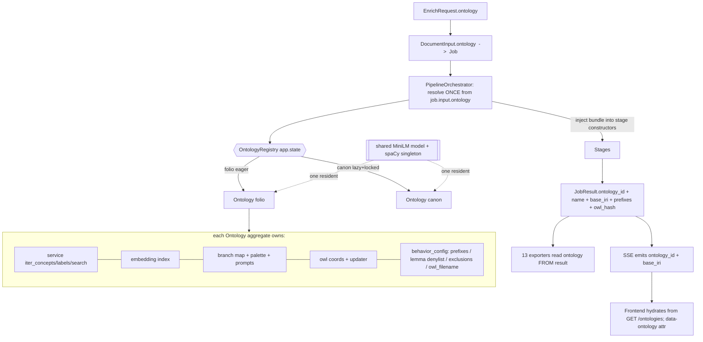
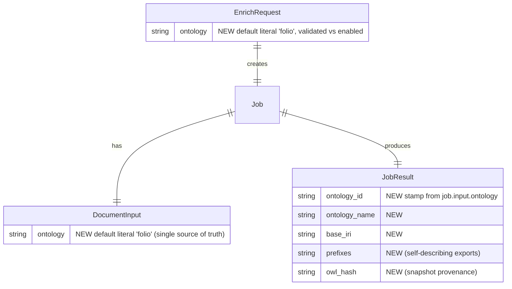

# ✨ feat: Multi-Ontology Support — Catholic Semantic Canon

## Enhancement Summary

**Deepened on:** 2026-07-01
**Sections enhanced:** Architecture, all 6 phases, ACs, Risks — plus a new **Security** section.
**Review agents used:** kieran-python, architecture-strategist, code-simplicity, performance-oracle, security-sentinel, julik-frontend-races, agent-native, data-integrity-guardian, frontend-design skill, external research (safe-XML + multi-tenant registry).

### Key improvements folded in
1. **Ontology *aggregate*, not three parallel keyed dicts.** One `Ontology` object owns its service + embedding index + branch cache + coords + behavior-config; the registry holds `dict[str, Ontology]`. Makes AC-2/IT-1 (no cross-contamination) *structural*, and fixes the currently-uninvalidated `_BRANCH_DETAIL_CACHE`-on-reload bug for free.
2. **Protocol seam kept minimal + `iter_concepts()`.** The abstraction must NOT expose `_get_folio()` (two consumers reach through it into folio-python's `OWLClass`). Add a neutral `iter_concepts()` record so the embedding builder + branch-detail stop touching the raw graph — otherwise the abstraction is cosmetic.
3. **New Security section (was absent).** The ~14MB Canon OWL is third-party, network-delivered, parsed-as-data, and re-served to users. Adds DOCTYPE-reject + hardened lxml parser + size cap + checksum/commit-SHA pin + HTTPS/host allowlist + authz on mutating `/ontologies/*` routes.
4. **Shared embedding model.** One MiniLM resident across all ontologies (like the existing spaCy singleton) — saves ~90 MB and a multi-second second load.
5. **Build-then-swap reload + per-key locked lazy-load** — fixes the latent non-atomic `_reload()` and the concurrent cold-start race without forcing eager init.
6. **Data-integrity fixes:** demo job IDs via `uuid5` (not the type-breaking `canon:<slug>` string), `rglob` for per-ontology demo subdirs, legacy jobs default to the **literal** `"folio"`.

### Tensions resolved (decisions)
- **T1 — Lazy vs eager Canon load:** **Lazy-load Canon** (FOLIO eager at startup) behind a **per-key double-checked lock** + **warm-on-dropdown-intent**. Bounds memory (perf) *and* removes the first-request race (python). ([[perf]], [[python]])
- **T2 — Keep the Protocol?** **Parameterize ONE `OntologyService` class** by config + a pluggable branch-derivation callable (both ontologies use the same folio-python loader). Keep the neutral `iter_concepts()` seam. Defer a formal multi-impl Protocol until/unless the rdflib fallback becomes real. (simplicity + python)
- **T3 — AC-1 "zero FOLIO literals":** **Infeasible as written** — `folio_iri`/`has_folio_link`/`FOLIO_CONCEPT` are model field names baked into 13 exporters + 356 frontend refs + baked demos. **Relaxed** to "zero cross-ontology *IRI / base-IRI / branch / namespace* literals"; legacy `folio_*` schema keys are a documented neutral export-schema constant, not an ontology-identity claim. (architecture)
- **T4 — History/URL:** Use `replaceState` to keep a **shareable** `?ontology=` URL in sync; **no per-toggle history entry**, `popstate` just re-resolves from the URL. (simplicity ∩ julik)
- **T5 — Demo count:** Start **~4 Canon demos (2 rich)**, expand later. (perf + simplicity)

---

## Overview

Let users enrich documents against a **second selectable ontology** — the **Catholic Semantic Canon** (`https://ontology.catholicos.catholic/`) — alongside the default **FOLIO**. The entire 14-stage pipeline, 13 exporters, extraction stages, OWL auto-update, and demo system stay intact; we make the *ontology* a request-scoped dimension instead of a process-global constant.

FOLIO remains the default and common case. Canon is opt-in via a **subtle "Ontology ▾" header dropdown** that swaps the active ontology and triggers a **light rebrand** (accent palette + masthead "**CatholicOS Enrich**" + Canon exemplars). One deployment; a standalone CatholicOS-branded deploy stays possible later via env var.

**Origin:** product decisions resolved in the brainstorm (see brainstorm: `docs/brainstorms/2026-07-01-multi-ontology-catholic-canon-brainstorm.md`).

## Problem Statement

The system is **~80% ontology-agnostic at the seams but 100% hardcoded to FOLIO in naming and wiring**. Three process-global singletons assume one ontology, the OWL machinery hardcodes `alea-institute/FOLIO`, `/enrich` has no ontology field, and the frontend carries 356 FOLIO references. We must convert the single-ontology globals into an **ontology-keyed aggregate registry** and thread an ontology id request → job → stages → results → exports — without regressing FOLIO, and without opening an XML/supply-chain hole.

## Proposed Solution

Introduce an **`Ontology` aggregate + `OntologyRegistry`** keyed by ontology id (`folio`, `canon`). FOLIO is the reference; Canon is a second entry loaded through the *same* folio-python parser (validated feasible), replacing only the FOLIO-hardwired **branch derivation** with **auto-derived roots**. Parameterize OWL cache/update, embedding index, LLM branch-prompts, and FOLIO-specific normalization per ontology. Add a data-driven frontend switcher + light rebrand hydrated from a machine-readable `GET /ontologies`. Author ~4 baked Canon demos from public-domain/licensed texts.

---

## Technical Approach

### Validated Feasibility (research, 2026-07-01)

- **folio-python 0.3.6 loads arbitrary OWL** via `FOLIO(source_type="http", http_url=…)` or a pre-seeded cache file. Parser, IRI lookup, parent/child walking, label search, and object-property parsing are all ontology-neutral; reads `rdfs:label` + `skos:prefLabel` + `skos:altLabel`.
- **Only hard incompatibility:** `get_folio_branches()` / `FOLIO_TYPE_IRIS` (24 hardcoded FOLIO roots). Canon auto-derives roots from top-level `owl:Class` nodes (empty `sub_class_of`). Wrapper-level, no fork.
- **DATA GATE:** every `owl:Class` **must carry `rdfs:label`** — folio-python's `is_valid()` silently drops `skos:prefLabel`-only classes. Must be RDF/XML, standard namespaces. → Phase 0.
- **Leaky seam to fix:** two consumers reach *through* the service into folio-python's `OWLClass` (`embedding/service.py:55` `folio_service._get_folio().classes`; `templates.py:57` `get_folio_branches()`). The interface must expose **neutral records** (`iter_concepts()`), never `_get_folio()`.

### Ownership model — the `Ontology` aggregate

**Why the aggregate (not three parallel `dict[str,X]`):** collapses the re-index chain duplicated in `owl_updater._do_apply` and `rollback`; makes `reload()` invalidate its *own* branch-detail cache (fixes a live staleness bug); makes AC-2/IT-1 a structural invariant (one request holds one `Ontology`, no shared global to leak).

### Data model (ERD)

`ontology` lives on `DocumentInput` (input contract, single source of truth); `JobResult` carries the denormalized **output stamp** exporters read. Do **not** also put it on `Job` — `job.input.ontology` is one hop. Defaults are the **literal `"folio"`**, never `settings.default_ontology` (else a future `DEFAULT_ONTOLOGY=canon` deploy relabels every legacy job).

---

## Implementation Phases

### Phase 0 — Feasibility & Security Spike (GATE, do first) 🔬

Throwaway `backend/scripts/validate_canon_owl.py`:
- Download Canon OWL; **DOCTYPE-reject + size-cap + hardened parser** (see Security) before anything.
- Load via folio-python; count classes **missing `rdfs:label`** (fail loudly if any); report object-property count (~396) and a sample `folio[iri]`/`get_parents` round-trip on Canon IRIs.
- **Auto-derive top-level roots**; report the **branch count** (drives palette overflow design).
- **Path-parity assertion (critical):** verify the cache path the updater writes (`github/{hash}.owl`) is byte-identical to the file folio-python resolves for `source_type` — folio-python caches HTTP under `http/{blake2b(url)}.owl`, a *different dir + hash input*. Mismatch → phantom rollbacks. Resolve the single ingestion path here.
- **Record the pinned SHA-256 + commit SHA** of the validated OWL (source of truth for integrity checks).

**Gate:** ≥99% class retention, usable root set, non-empty object properties, path parity confirmed. If the `rdfs:label` gate fails → lightweight rdflib loader adapter (fallback, otherwise out of scope). *Promote this script's assertions into IT-2 rather than writing a second test.*

#### Phase 0 Findings — RUN 2026-07-01 (`backend/scripts/validate_canon_owl.py`) → **GATE PASSED** ✅

- **Load feasibility confirmed:** 13.2 MB OWL, **14,973 classes** + **166 object properties** loaded via `FOLIO(source_type="http", …)`. No fork, no rdflib fallback needed.
- **`rdfs:label` gate is a non-issue:** only **2 of 14,974** named classes lack `rdfs:label` → **99.99% retention**. (Still enforce the loud build-time check for future OWL revisions.)
- **Pinned integrity value (use for the checksum control):** `sha256 = add8b2b140273b197b759f8945b4f5aa66ecb1ec801fcc69431f1b4baaf59f24`. Security gate passed: no DOCTYPE, hardened parser OK.
- **Branch auto-derivation works → 10 raw roots**, of which **~7 are real**: *Actor, Event, Place, Document/Artifact, Authority (Source and Scope), Normative Concepts, Operational Concepts.* Filter `owl:Thing` (1) and **two ZZZ/deprecated markers** (`ZZZZ - Deprecated`, `ZZZ - Licensing`).
  - **NEW — Canon reuses FOLIO's `ZZZ`/deprecated editorial convention** → the `behavior_config.exclusion_markers` (`ZZZ`, deprecated) **transfers directly** from FOLIO; not a from-scratch job. Canon is evidently a **FOLIO-derived ontology re-skinned** for Catholic content (Actor/Event/Place/Document/Authority mirror FOLIO), which de-risks pipeline compatibility further. Palette needs only ~7 colors — the hash-to-ramp overflow concern is minimal.
- **NEW — mixed IRI namespaces:** some Canon classes carry `http://webprotege.stanford.edu/…` IRIs alongside `https://ontology.catholicos.catholic/…` (sample round-trip class was a webprotege IRI). → `base_iri` stamping (Phase 5) and prefix handling must tolerate **multiple** IRI roots per ontology, not assume a single `base_iri`. Add to `behavior_config` as `iri_roots: list[str]`.
- **NEW — path parity risk CONFIRMED empirically:** folio-python wrote Canon to `~/.folio/cache/http/6fc7…owl` while the app's `owl_cache.py` writes/reads `~/.folio/cache/**github**/{hash}.owl`. The updater and loader read **different files** unless unified — validating the data-integrity agent's phantom-rollback finding. Phase 2 must route both through one ingestion path (app downloads → writes the exact file folio-python resolves).
- **Minor data-quality notes:** 16× `Parent class not found: …/Agreements` (dangling superclass ref, handled gracefully); one `get_parents` chain contained a `None` label. Non-blocking; note for the loud validator.

### Phase 1 — Ontology aggregate + registry (backend core)

> **Status (2026-07-01): foundation landed** on `feat/multi-ontology-registry` (PR pending). Done: `OntologyRegistry` + `OntologySpec`/`OntologyBehavior` (FOLIO + Canon specs), per-ontology behavior externalized (prefix-strip, lemma-denylist, exclusion markers, coords, iri_roots), `FolioService` parameterized by spec, `iter_concepts()` seam (embedding builder no longer reaches through `_get_folio()`), stable `blake2b` branch palette, config `default_ontology`/`enabled_ontologies`, registry with per-key lock. FOLIO byte-neutral (759 tests green; 18,326 concepts / 69,368 labels unchanged). **Deferred to Phase 2** (need a live 2nd ontology to exercise/test): shared-MiniLM singleton, build-then-swap reload, lazy-Canon eviction, embedding-index registry keying, `app.state`/lifespan ownership, `owl_cache` per-ontology parameterization.

- **`Ontology` aggregate** (`app/services/ontology/ontology.py`) owning `service`, `embedding_index`, `branch_map`/`palette`/`branch_examples`, `owl_coords` + updater, `behavior_config`.
- **`OntologyRegistry`** (`app/services/ontology/registry.py`) — `dict[str, Ontology]`, built in FastAPI **`lifespan`**, stashed on `app.state.ontology_registry` (no module-global access from 8 files). **FOLIO eager**; **Canon lazy** via **per-key double-checked lock** (`threading.Lock` per id; build inside the lock; fast path lock-free). No implicit default inside request scope; unknown id → `UnknownOntologyError` → 4xx.
- **Parameterize the ONE `OntologyService`** (rename from `FolioService`) by `ontology_id` + coords + a **pluggable branch-derivation callable**. Add **`iter_concepts()`** returning neutral records; rewrite `build_embedding_index` + `build_branch_detail` to consume it (kills the `_get_folio()` reach-through).
- **Move FOLIO-specific behavior into `behavior_config`** (per ontology), not shared code: `prefix_strip_list` (`folio:`/`utbms:`/`oasis:` — **load-bearing for property-match keys**, not "harmless"), `lemma_denylist` (legal terms; Canon gets an empty/neutral profile), `exclusion_markers`/`excluded_branches`, and **`owl_filename`** (`FOLIO.owl` is hardcoded).
- **Shared embedding model:** make the MiniLM `LocalEmbeddingProvider` a module-level singleton injected into every per-ontology embedding index (mirror `spacy_singleton.py`). Exactly one model resident regardless of ontology count.
- **Branch auto-derivation + stable palette:** derive roots from top-level `owl:Class`; assign a **sacral color ramp by `blake2b` digest** (NOT builtin `hash()` — per-process salt breaks color stability across workers; AC-8), modulo overflow. Frontend uses the *same* stable algorithm.
- **Config** (`config.py`): `default_ontology="folio"`, `enabled_ontologies=["folio","canon"]`, and a per-ontology registry entry (coords, `owl_filename`, `base_iri`, `prefixes`, `behavior_config`, `brand`) — **with URL allowlist validation** (see Security). Include a `cache_namespace` used for **both** embedding *and* lemma cache filenames.
- **Reload = build-then-swap:** construct a fully-populated new `Ontology` and rebind the registry entry in a **single** assignment (GIL-atomic). Removes the half-built-state window in `_reload()`/`index_labels`. Preserve the idle-gate as defense-in-depth.

### Phase 2 — Per-ontology OWL update + request threading + result stamping

- **Parameterize `owl_cache.py`** (module globals → per-ontology coords threaded through every fn; keep the `OWLDownloadError`-raising contract). **Thread the correct per-ontology `owl_hash`** into the embedding *and* lemma cache keys (both currently read the FOLIO global hash → wrong-index bug).
- **`OWLUpdateManager` → per-ontology**; the re-index chain lives on `Ontology.reload()`.
- **Scope `count_active()` by ontology** (add `ontology` to the stored job JSON; filter the scan) so a Canon update doesn't head-of-line-block on FOLIO jobs (and vice-versa); make the poll O(1) via an in-memory per-ontology counter.
- **Routes:** `/ontologies/{id}/update/{status,check,apply,rollback}`; keep `/folio/update/*` as **thin delegation aliases** (`id="folio"` bound) for deploy-skew safety. Add **`GET /ontologies`** and **`GET /ontologies/{id}`** as the machine-readable source of `{id, display_name, base_iri, prefixes, default, enabled, ready, branches[{iri,label,color}], owl_hash}` + a global `embeddings_available` capability (folds in the old `/health`). Update the existing top-level `/health`.
- **Request threading:** add `ontology: str = "folio"` to `EnrichRequest` with a **`field_validator` against `enabled_ontologies`** (unknown/disabled → 400 listing enabled; echo the *resolved* ontology in the response). Persist on `DocumentInput`. **Resolve the `Ontology` ONCE in the orchestrator** from `job.input.ontology` and **inject the bundle into stage constructors** (extend the existing injection at `property_matcher.py:56`, `resolver.py:28`, embedding builder) — do NOT add `get_instance()` to 8 stages or a param to the stage ABC. Move stage construction to after `job.input.ontology` is known.
- **Not-ready contract:** cold Canon → `202`/`Retry-After` (or `ready:false` on `GET /ontologies/{id}`) so API clients poll; never block the worker (load in `run_in_executor`).
- **Ontology-parameterize LLM prompts** (`templates.py`): `FOLIO_BRANCHES`/`BRANCH_EXAMPLES`/`BRANCH_LIST`/`build_branch_detail` ontology-aware; author a **Canon `BRANCH_EXAMPLES`** (Scripture, Doctrine, Liturgy, Persons, Councils, Sacraments…) with a graceful auto-generated fallback. Fix cosmetic "FOLIO" strings in `concept_identification.py`, `contextual_rerank.py`, `individual_extraction.py`, `property_extraction.py`.
- **Result stamping:** stamp `JobResult.ontology_id/name/base_iri/prefixes/owl_hash` from `job.input.ontology` at creation. Emit `ontology_id`+`base_iri` on the **SSE** initial + `complete` events (mirror `total_triples`).
- **Exit gate for this phase: IT-1 (concurrency leakage) passes.** It proves de-globalization worked; don't defer it to Phase 6.

### Phase 3 — Frontend switcher + light rebrand (`frontend/index.html`)

*Design reference: the frontend-design spec (crimson-accent + antique-gold brand-mark, `data-ontology` attribute, Cormorant Garamond serif wordmark, `menuitemradio` ARIA, sacral branch ramp) — captured in Research Insights below.*

- **`data-ontology` attribute on `<html>`** (peer of `data-theme`); Canon tokens via `[data-theme][data-ontology="canon"]` — higher specificity, no `!important`, FOLIO default untouched.
- **Pre-paint resolver:** a second inline `<head>` script (mirror the theme script at `:3280`) resolving **`?ontology=` > `localStorage['ontology']` > `folio`**, allowlist-checked (unknown → `folio` + post-paint toast; AC-5), setting `data-ontology` + a minimal inline palette/masthead **before first paint** (no flash). Full branch metadata hydrates from `GET /ontologies` after paint.
- **Demo deep-links carry ontology in the URL** (`?ontology=canon&demo=<slug>` — extend the exemplar click and the `canon:`-prefixed slug) so the head script resolves synchronously; the demo JSON's baked `ontology` field remains the correctness authority.
- **Single source of truth `let activeOntology`;** `applyOntology(id,{push,persist})` **idempotent + pure** (no-op guard; `setProperty` not append; masthead `textContent`; exemplar grid `innerHTML` replace).
- **Capture-at-submit:** stamp `activeOntology` onto the job at submit; **disable the switcher while `eventSource !== null`**; render completion against the captured ontology (satisfies AC-7 cheaply — no queue).
- **Cancel the orphaned 4 s timer** (`:6159`) via a token + re-check `currentJobId` after every `await` in `fetchFinalJob` (prevents a stale FOLIO job repainting under Canon palette).
- **Order on switch:** clear results pane → swap palette (never reverse; palette is global CSS vars, would recolor stale FOLIO spans for a frame). Palette swap is **instant** (no transition on the vars); crossfade only the accent *chrome*.
- **URL sync via `replaceState`** (shareable), **no per-toggle history entry**; `popstate` re-resolves ontology from URL (palette first, then hydrate) with `{push:false,persist:false}`.
- **Reload restore:** bake `ontology` into `cacheState()`/`restoreState()`; head script reads last-active from `localStorage` for pre-paint. **BYOK keys stay provider-namespaced, ontology-agnostic** (invariant).

### Phase 4 — Canon demos (namespaced bake pipeline)

> **Demo-size decisions (2026-07-01, user-approved):** Baked demos are 84 MB / `.git` 82 MB. Analysis of `merger.json` (7.5 MB): **46%** is FOLIO concept metadata (`folio_definition/examples/notes/see_also/alt_labels/...`, 25 fields) baked into each annotation's candidates; **40%** is per-stage `metadata` dumps (`resolved_concepts` 2 MB, `ruler_concepts`, `reconciled_concepts`, `llm_concepts`); files are already minified (0% whitespace). **Chosen: slim in-tree** (no move-out, no LFS/R2) — (a) drop the per-stage `*_concepts` metadata dumps not used for rendering; (b) strip heavy `folio_*` detail from annotation candidates, keeping IRI/label/confidence/state/branch, and hydrate the rest from the ontology by IRI in the frontend tooltip/detail panel. Est. 84 MB → ~20–30 MB; Canon demos born slim. **Then** reclaim the existing 82 MB `.git` with a **one-time `git filter-repo`** history rewrite (force-push + collaborators re-clone) — sequenced **after** slimming so we rewrite once. gzip-at-rest rejected (binary blobs churn history).

- **Namespace end-to-end:** second `SAMPLES` set → `extract_exemplars.py`/`demo_documents.py` gain an ontology dimension → `frontend/demos/<ontology>/<slug>.json` → per-ontology freshness sidecars → `demo_seed.py` uses **`rglob("*.json")`**, seeds both, and **asserts `seeded == file_count`** at startup (AC-9; stop the bare-`except` silent-skip).
- **Demo job IDs via `uuid5`**, NOT the string `canon:<slug>` (breaks `Job.id: UUID`, all `job_id: UUID` routes, and Windows filenames): `uuid5(DEMO_NS, f"{ontology}:{slug}")`.
- **Bake `ontology` into each demo JSON;** `?demo=` load auto-switches to the demo's ontology before first paint.
- **Author ~4 Canon demos (2 rich).** Sources: **public domain + explicitly licensed** (Douay-Rheims/KJV, Church Fathers via CCEL, Aquinas, older encyclicals, Baltimore Catechism). **License-verify each passage before committing.** Short texts (fast processing, smaller JSON).
- **Re-emit FOLIO demos** via `replay_fix_demos.py` (deterministic, zero LLM cost) so their baked `JobResult` carries `ontology_id:"folio"`; bake Canon last (after result-model + exporters are ontology-correct).

### Phase 5 — Exports & results correctness

- **All 13 exporters read ontology from `job.result`** (id/base_iri/prefixes), never registry defaults — fix JSON-LD `@context`, RDF/Turtle `Namespace`, Neo4j/brat labels. Validate `base_iri`/`prefixes` are well-formed absolute HTTPS IRIs.
- **Cross-link resolvers** (IND/CLS/PROP) resolve against `job.ontology`, not the global.
- **Empty-state UX:** wrong-ontology-for-text → friendly prompt with one-click switch (uses `GET /ontologies` to enumerate alternatives). Low priority; generic empty state acceptable for v1.

### Phase 6 — Testing, parity, deploy

- **Integration tests:** **IT-1** (concurrent FOLIO+Canon, no leakage — highest value, gate of Phase 2) · **IT-2** (Phase-0 script promoted: real Canon OWL → branch/class/property counts + path parity) · **IT-3** (shrunk to a `uuid5` collision + `rglob` seed-count unit test) · **IT-5** (real Canon job → all 13 formats, grep for stray cross-ontology IRIs/namespaces) · **IT-4** reduced to one assertion (Canon with embeddings off returns non-empty) · **Legacy fixture** (pre-change job JSON exports cleanly as FOLIO). · **Security ACs S1–S5** as tests.
- **DEV parity:** Canon degrades gracefully with embeddings disabled (shared code path).
- **PROD:** pre-seed the **Canon embedding `.pkl`** (uv-managed venv, no `pip`). **Hard warn** at startup if an enabled ontology has no seed cache while embeddings are on.
- **Memory budget gate:** measure RSS FOLIO-only vs FOLIO+Canon resident; set a PROD ceiling (target ≤ 2 resident ontologies, one MiniLM).
- **Demo git bloat:** `.git` is already 82 MB, `frontend/demos/` 84 MB. Strongly prefer **moving baked demos to Git LFS or an artifact store** (coordinate the `git lfs migrate`), or at minimum minify + serve gzip. Cap Canon at ~4.
- **Confirm the Railway trigger branch** for folio-enrich before first deploy (docs contradict: MEMORY says `main`, handoff says `dev`).

---

## Security (NEW — required before Phase 2 ships)

The Canon OWL is third-party, network-delivered, parsed-as-data across 14 stages, and re-served to users; the fetch target is becoming config-driven; new mutating routes appear. Verified against the live stack: **neither the app's `etree.fromstring` (`owl_cache.py:190`) nor folio-python's parser sets `resolve_entities=False`** — internal DTD entities *are* expanded today; external-entity/file XXE is blocked only by a version-dependent libxml2 default. No size cap, no integrity check, `follow_redirects=True`.

**P0 mitigations:**
- **Reject any `<!DOCTYPE>`** in the fetched bytes before caching/parsing (valid OWL RDF/XML needs none) — neutralizes entity-expansion DoS + XXE + SSRF-via-DTD in one guard, version-independent.
- **Hardened parser** for all ingestion: `etree.XMLParser(resolve_entities=False, no_network=True, load_dtd=False, dtd_validation=False, huge_tree=False)`. (`defusedxml.lxml` is deprecated; harden lxml directly.)
- **App is the SOLE ingestion point:** download → size-check → DOCTYPE-reject → checksum-verify → write cache → have folio-python load **from the local cache**. Never use folio-python's direct `source_type="http"` fetch in prod (it's un-sized, un-timed, un-guarded).
- **Size cap (~32 MB), streamed** with byte-count abort; keep the 30 s timeout.
- **Integrity:** verify SHA-256 against the Phase-0 pinned value; **pin a commit SHA**, not moving `main`; HTTPS-only; drop cross-origin redirects.

**P1:** URL **allowlist** at registry load (scheme=https, host ∈ {`raw.githubusercontent.com`,`api.github.com`}, reject private/loopback/link-local/metadata IPs, no creds/odd ports); **authz on `/ontologies/{id}/update/{check,apply,rollback}`** (admin-only — same posture as the shipped `require_user_api_key` fix; audit the existing `/folio/update/*` too); **rate-limit** fetch-triggering routes; validate the `ontology` request field server-side.

**Security ACs:** (S1) DOCTYPE OWL rejected loudly · (S2) oversize body aborted without OOM · (S3) checksum mismatch keeps previous version · (S4) non-allowlisted/private-host `owl_url` rejected at registry load · (S5) unauthenticated `apply`/`rollback` denied.

---

## Alternatives Considered

- **Standalone rdflib loader for Canon** — fallback only (re-implements search tries/traversal/`OWLClass` shape); trigger only if Phase 0 fails the `rdfs:label`/RDF-XML gate.
- **Hardcode two ontologies** — rejected (brainstorm): seams are registry-shaped; special-casing 23 files is more work.
- **Three parallel keyed dicts** — rejected (this deepening): the `Ontology` aggregate is the correct ownership model.
- **Eager-init both ontologies** — rejected for Canon: doubles startup work + resident memory; lazy+locked achieves the same race-safety.
- **Separate CatholicOS deploy now** — deferred (registry makes it one env var later).

---

## System-Wide Impact

- **Interaction graph:** `/enrich{ontology}` → `Job(input.ontology)` → orchestrator resolves the `Ontology` once → injected into stage constructors → `JobResult{ontology_id,…}` → SSE emits ontology → frontend rebrands per result → `/export` reads ontology from the persisted job.
- **Error propagation:** `OWLDownloadError` per ontology (keep raising); cold/unreachable Canon fails soft to last-good cache, never blocks FOLIO; DOCTYPE/size/checksum rejections logged distinctly from network errors.
- **State lifecycle:** demo `uuid5` IDs + per-ontology subdirs close overwrite risk; mid-job switch never mutates `job.input.ontology`; build-then-swap reload has no half-built window; per-ontology `_search_cache` isolated by construction (don't re-globalize).
- **API parity:** `GET /ontologies` + `/ontologies/{id}` are the machine-readable metadata source (frontend hydrates from them → also fixes 356-ref sprawl); SSE + `/enrich` carry ontology; update lifecycle fully API-reachable.

---

## Acceptance Criteria

### Functional
- [ ] **AC-1 (relaxed):** A Canon job's result + all 13 exports contain **zero cross-ontology IRI / base-IRI / branch / namespace literals** (FOLIO IRIs, `folio.openlegalstandard.org`, FOLIO branch names). Legacy `folio_*` *schema keys* are a documented neutral constant, out of scope. Verified per exporter.
- [ ] **AC-2:** Concurrent FOLIO+Canon requests return non-cross-contaminated concepts/branches/embeddings.
- [ ] **AC-3:** A Canon OWL violating the `rdfs:label` gate fails the build loudly (names offenders).
- [ ] **AC-4:** Precedence `?ontology=` > localStorage > FOLIO default; deep links (incl. demo links) pre-resolve before first paint (no flash).
- [ ] **AC-5:** `?ontology=` disabled and `?demo=<foreign-slug>` resolve to a safe labeled state; server rejects unknown `ontology` with 400 listing enabled.
- [ ] **AC-7:** Switching ontology with a job in flight doesn't alter that job's ontology, streamed-result branding, or export labeling (switcher disabled while streaming).
- [ ] **AC-8:** Canon branch roots each map to a **stable** (`blake2b`) color with defined overflow; identical across workers/restarts.
- [ ] **AC-9:** Demo seeding uses `uuid5((ontology,slug))`; `seeded == demo_file_count` (both ontologies, `rglob`), no overwrite.
- [ ] Loading a Canon `?demo=` auto-switches + rebrands; cross-links resolve against the demo's ontology.

### Non-Functional
- [ ] **AC-6:** Embeddings-off (DEV) Canon degrades identically to FOLIO's path.
- [ ] No FOLIO regression (existing 600+ tests green); legacy persisted jobs read/export as FOLIO.
- [ ] Switcher: keyboard-accessible, `menuitemradio` roles, focus-visible ring, `prefers-reduced-motion`-safe.
- [ ] Memory: ≤ 2 resident ontologies, exactly one MiniLM; RSS ceiling met.

### Security (Quality Gate)
- [ ] **S1–S5** (DOCTYPE reject · size-cap no-OOM · checksum keeps previous · host allowlist · authz on mutating routes).

### Integration Tests
- [ ] **IT-1** concurrency/no-leakage (Phase 2 gate) · **IT-2** real Canon OWL load + path parity · **IT-3** `uuid5`/`rglob` collision+seed-count unit · **IT-4** Canon embeddings-off returns results · **IT-5** Canon job → 13 formats, no stray cross-ontology literals · **Legacy** fixture exports as FOLIO.

---

## Success Metrics
- Canon "rich" exemplars hit high density (parity with FOLIO rich, scaled to ontology size).
- Zero FOLIO regressions.
- **Extensibility proof:** a 3rd ontology needs only a registry entry (coords + `behavior_config` + palette + demos) — no stage, exporter, or switcher edits. (Requires: behavior-config externalized, neutral export-schema contract, frontend hydrated from `GET /ontologies`.)

## Dependencies & Prerequisites
- Canon OWL passes Phase 0 gates + pinned SHA-256/commit.
- LLM key for Canon demo bake; PROD embedding-seed capacity for a second ontology.

## Risk Analysis & Mitigation

| Risk | Likelihood | Impact | Mitigation |
|------|-----------|--------|-----------|
| Third-party OWL poisoning / MITM (no integrity check) | Medium | **High** | Checksum + commit-SHA pin, HTTPS, DOCTYPE reject, size cap (Security) |
| XXE / entity-expansion DoS via OWL | Low-Med | High | Hardened lxml parser + DOCTYPE reject; app-sole-ingestion |
| Canon classes lack `rdfs:label` (silent drop) | Medium | High | Phase 0 gate; rdflib fallback |
| Global-singleton leakage under concurrency | Medium | High | `Ontology` aggregate + per-key lock; IT-1 |
| Two ontologies + 2 embedding matrices resident | High | Medium | Lazy Canon + LRU cap 2 + shared MiniLM; memory-budget gate |
| Cross-ontology idle-wait HOL block | Medium | Medium | Scope `count_active` by ontology; O(1) poll |
| Reload transient 2×–4× memory spike | Medium | Medium | Build-then-swap, drop old refs, serialize reloads |
| `canon:<slug>` string ID breaks UUID typing | High (if naive) | High | `uuid5((ontology,slug))` |
| github vs http cache-path mismatch (phantom rollback) | Medium | High | Phase 0 path-parity assertion; single ingestion path |
| AC-1 "zero FOLIO literals" infeasible | — | — | Relaxed to cross-ontology literals (T3) |
| Demo git bloat (82 MB `.git`, growing) | High | Low-Med | LFS/artifact store; minify; cap Canon at ~4 |
| Frontend sprawl (356 refs) | High | Medium | Single config hydrated from `GET /ontologies`; no 2nd hardcoded UI |
| Copyright on Canon demo texts | Low | High | PD-by-default; per-passage verification |
| Railway trigger-branch confusion | Medium | Medium | Confirm before deploy |

## Future Considerations
- 3rd+ ontologies as registry entries; standalone CatholicOS deploy via env var.
- Formal `OntologyService` Protocol once a structurally-different (rdflib) loader exists.
- Deep theme (typography/hero art) if the light rebrand proves insufficient.

## Documentation Plan
- Update `CLAUDE.md` (ontology aggregate/registry, request threading, per-ontology demos, security posture).
- New `docs/HANDOFF-<date>-multi-ontology.md` (registry design, Canon coords + pinned SHA, demo bake/seed, DEV/PROD embedding notes, memory budget).
- Update MEMORY.md pointers.

---

## Research Insights (from deepening agents)

### Backend architecture & Python (kieran-python, architecture-strategist)
- Protocol must expose **neutral records + `iter_concepts()`**, never `_get_folio()`; the two reach-throughs (`embedding/service.py:55`, `templates.py:57`) otherwise defeat the abstraction.
- Prefix-strip / lemma-denylist / exclusion markers are **FOLIO-specific and load-bearing** (esp. prefix-strip for property-match keys) — externalize to `behavior_config`, don't inherit.
- Field-naming (`folio_iri`, `has_folio_link`, `FOLIO_CONCEPT`, RDF `Namespace`) is baked into models + 13 exporters + frontend + demos → AC-1 relaxed (T3).
- `_reload()` "thread-safe via GIL" comment is false (7-field sequential mutation) → build-then-swap.

### Performance (performance-oracle)
- Per-ontology footprint ~300–500 MB (parsed graph 150–350 MB + 2 embedding matrices + risk of a **2nd MiniLM ~90 MB**). Share the model; lazy-load Canon; LRU cap 2; drop the duplicate `_vectors` copy in `FOLIOEmbeddingIndex`.
- `count_active()` is a global O(jobs) FS scan with no ontology filter → cross-ontology 300 s idle-wait HOL block; scope + O(1).
- `.git` 82 MB / demos 84 MB → LFS/artifact store; the demos are generated artifacts, not source.

### Frontend races (julik) & design (frontend-design)
- Traps: pre-paint must be in `<head>` (not `init()`); the uncancelable 4 s timer (`:6159`) reads globals; palette is document-global (recolors stale spans); demo ontology only known post-fetch → **carry ontology in the URL**.
- Design: `data-ontology` attribute; **crimson accent (`#c34455`/deep `#9c2d3b`) + antique-gold brand-mark (`#c9a227`)** — action vs. identity split preserves white-on-accent buttons with zero overrides; Cormorant Garamond serif wordmark loaded on first Canon switch; `menuitemradio` menu semantics; sacral ramp by stable hash; instant palette swap, crossfade only chrome; masthead kicker "Semantic enrichment for the Catholic canon."

### Agent-native (agent-native-reviewer)
- Make `GET /ontologies` + `/ontologies/{id}` the machine-readable metadata source (branches/palette/base_iri/prefixes/ready/version); frontend hydrates from it. Add ontology to SSE; define `/enrich` contracts for invalid/disabled/not-ready; add `GET /ontologies/{id}/demos`.

### Data integrity (data-integrity-guardian)
- `canon:<slug>` breaks `Job.id: UUID` (silent skip via bare `except`) → `uuid5`. `demo_seed.py` needs `rglob` for subdirs + `seeded==count` assert. Legacy defaults must be **literal `"folio"`**. Embedding+lemma pkl must key on the **per-ontology** `owl_hash`.

### External research
- **lxml hardening:** `resolve_entities=False, no_network=True, load_dtd=False, huge_tree=False`; `defusedxml.lxml` deprecated. Stream downloads with byte-cap + timeout + SHA-256; ETag/`If-None-Match` for 304 skips.
- **Multi-tenant registry:** per-key double-checked locking (build inside per-key lock, fast path lock-free); own the registry via FastAPI `lifespan` on `app.state`; `LRUCache` with an eviction hook to free FAISS native memory; `ContextVar` for request-scoped identity, never a module global.

## Sources & References

### Origin
- **Brainstorm:** [`docs/brainstorms/2026-07-01-multi-ontology-catholic-canon-brainstorm.md`](../brainstorms/2026-07-01-multi-ontology-catholic-canon-brainstorm.md) — decisions: same app + light rebrand; registry for N; subtle "Ontology ▾"; masthead "CatholicOS Enrich"; auto-derive branches; sources PD + licensed; normal push rules.

### Internal (verified this session)
- OWL: `owl_cache.py:22-39,87-207` (parse `:190` to harden), `owl_updater.py:104-214` (dup re-index chain), `folio_update.py`, `health.py:36`.
- Ontology: `folio_service.py:99-176,198-220,251-268,281-284,310-368,508-513`; `branch_config.py`; folio-python `graph.py:174-186,446-553,594-770,952-990,1852-1864`, `models.py:160-167`.
- Threading/config: `config.py`; `enrich.py:25-33,68-91`; `orchestrator.py:82-93,109-184`; `stages/base.py:14-17`; `models/{job,document}.py`; call sites `entity_ruler_stage.py:58`, `string_match_stage.py:74`, `individual_stage.py:122,200`, `property/{property_matcher.py:56,llm_property_identifier.py:68,120}`, `folio/resolver.py:28`, `concept/branch_judge.py:29`.
- Embeddings: `embedding/service.py:23,31-84,143-155,258-306`; `folio_index.py:43-80`; `main.py:28-49`.
- Prompts: `templates.py:9-129`; `{concept_identification,contextual_rerank,individual_extraction,property_extraction}.py`.
- Demos/store: `frontend/index.html` (head resolver `:3278`, init `:4493`, demo hydrate `:4401`, popstate `:4546`, submit `:5964`, SSE `:6043`, timer `:6159`, fetchFinalJob `:6290`); `scripts/{extract_exemplars,demo_documents,generate_demos,replay_fix_demos}.py`; `demo_seed.py:22-45`; `storage/job_store.py:25-64`; `docs/HANDOFF-2026-05-25-demo-exemplars.md`.
- Exporters/model: `models/annotation.py` (`folio_*` fields); `services/export/*` (rdf `Namespace:21`, brat/jsonld/es literals).

### External
- Canon OWL: `github.com/CatholicOS/ontology-semantic-canon` (raw verified 2026-07-01: ~14MB, ~15K `owl:Class`, 396 object-property entries, SKOS labels, base IRI `https://ontology.catholicos.catholic/`).
- lxml/defusedxml XXE guidance; requests streaming/size limits; cachetools/FastAPI lifespan + `ContextVar` concurrency patterns (see Research Insights links in agent outputs).

### AI-Era Notes
- Plan grounded by 10 parallel agents (python, architecture, simplicity, performance, security, frontend-races, agent-native, data-integrity, frontend-design, external research). Feasibility, the three-singleton coupling, and the XML attack surface were verified against installed source, not assumed. Prioritize IT-1 and the Security ACs — they cover what mocked unit tests structurally cannot.
