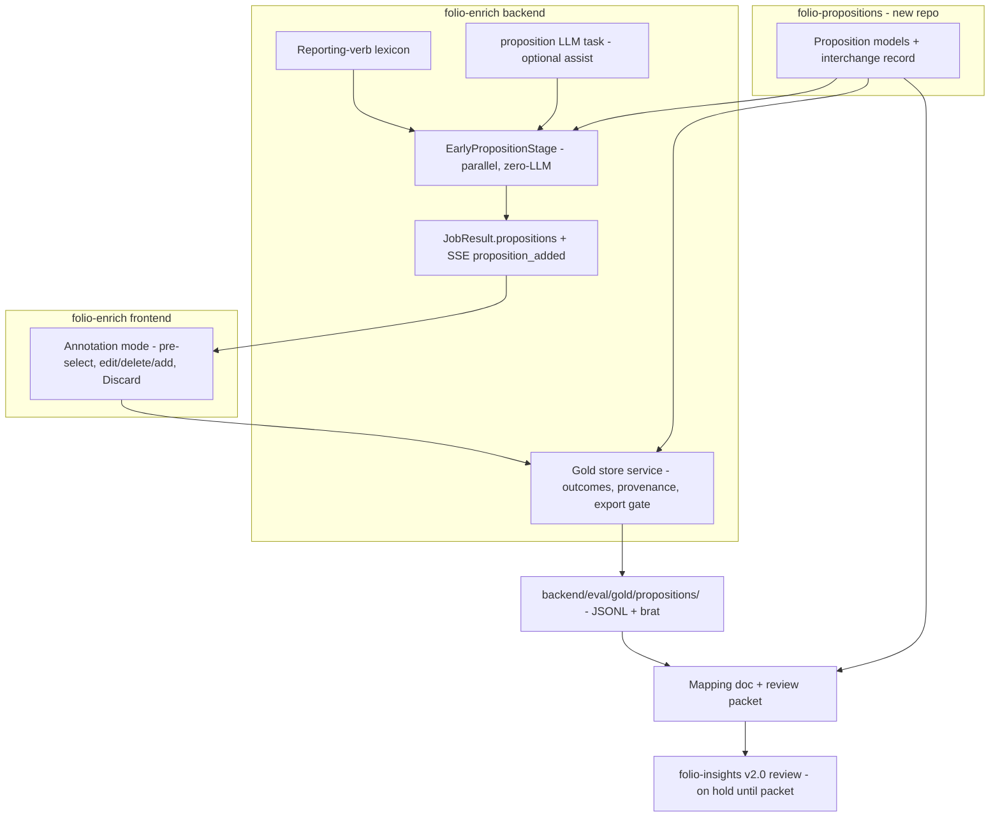
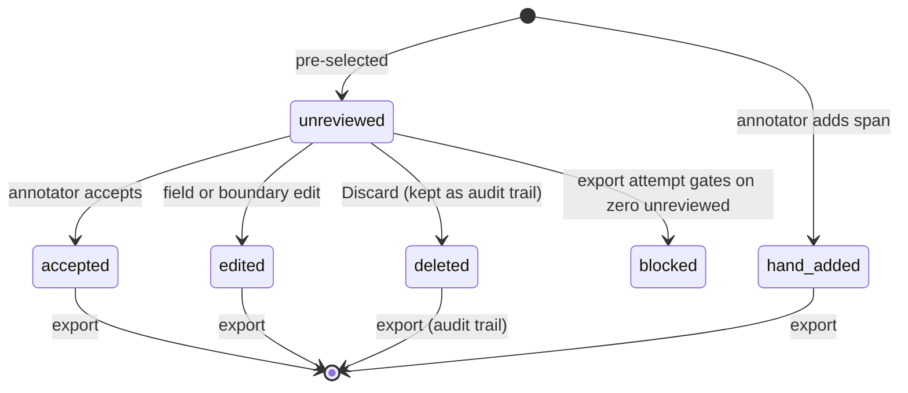

# Proposition System Phase A - Plan

## Goal Capsule

- **Objective:** Ship Phase A of the Proposition System: a gold-opinion annotation mode in folio-enrich's frontend, the double-entry Proposition schema as working Pydantic models in a new `folio-propositions` library (models + interchange record only), and a shard-mapping doc — together forming the review packet for folio-insights' v2.0 shard-envelope redesign.
- **Product authority:** This plan owns Phase A only. Phases B–E of the Proposition System (see How This Work Fits Together) are context, not active scope.
- **Open blockers:** None. Gold-opinion selection and persistence mechanics are deferred to planning (see Outstanding Questions).

---

## Product Contract

### Summary

An LLM-assisted annotation mode in folio-enrich where real judicial opinions run through the pipeline and the annotator corrects, deletes, and adds proposition spans — each annotation carrying type, asserter, validator, disposition, and provenance. The annotations falsify and refine the proposition taxonomy, and the resulting schema ships as working models in `folio-propositions` plus a mapping doc, presented at the folio-insights v2.0 review.

### Problem Frame

Proposition extraction is greenfield: no institutional priors exist, and the taxonomy so far is designed, not tested. Building the extraction pipeline against an unfalsified taxonomy risks encoding the wrong types into stages, exports, and UI. Meanwhile folio-insights' v2.0 PRD is about to redesign its shard envelope — proposition-vocabulary work that, done independently, would create a rival schema to the one folio-enrich needs. Phase A resolves both: annotation of real opinions tests the taxonomy before pipeline investment, and the validated schema lands once, in a shared library both applications consume.

### Key Decisions

- KD1. **One plan owns all of Phase A** — tool, schema, and library stay coupled so the schema presented for v2.0 review has survived at least one annotation cycle. (session-settled: user-directed — chosen over splitting schema+library into a deadline-driven plan: splitting risks presenting an unfalsified schema.) Governs R12, R14.
- KD2. **The annotation tool lives in folio-enrich's frontend** as an annotation mode that becomes the future Propositions tab and its review controls. (session-settled: user-approved — chosen over extending folio-insights' SvelteKit review UI: convergence with the future tab beats UI reuse.) Governs R1, R6.
- KD3. **Gold corpus is real opinions, on a small ladder** — one dense published appellate opinion first, growing toward ~5–6 across court levels. (session-settled: user-approved — chosen over annotating the baked synthetic exemplars first: synthetic prose under-stresses the taxonomy.) Governs R12, R13.
- KD4. **The first-opinion gate is a learning instrument, not pass/fail** — new proposition types and proposition density are expected outputs; unclassifiable or forced spans are captured learnings that drive taxonomy revision. (session-settled: user-directed — chosen over a quantitative failure threshold.) Governs R14, and shapes Success Criteria.
- KD5. **The v2.0 review packet is working models + mapping doc**, and the review date is a soft target — the schema ships when ready. (session-settled: user-directed — chosen over a schema-doc-only packet and over treating 2026-08-23 as a hard deadline.) Governs R10, R11.
- KD6. **Models-first hybrid library** — `folio-propositions` starts with Pydantic models + the interchange record only; stage logic stays in folio-enrich and migrates as it stabilizes. (session-settled: user-directed — chosen over full library day-one and over enrich-first-extract-later: no premature API freeze, no sixth bridge adapter.) Governs R7, R9.
- KD7. **Parallel tracks with the LLM-assisted annotation process** — pre-selection + edit/delete/add + taxonomy augmentation, built while the schema drafts; the annotation surface and the future review controls are one component. (session-settled: user-directed — the user authored the process; chosen over a strict eval-first gate on all code.) Governs R1–R5.
- KD8. **The library is carved out of folio-insights' shard vocabulary, and the v2.0 redesign and the library model are one work item.** (session-settled: user-approved — chosen over building a schema beside insights' existing one: two proposition vocabularies would drift.) Governs R8, R10.
- KD9. **The double-entry ledger schema** — asserter and validator sides with null as a first-class state, disposition enum, typed citation edges, axiom as earned lifecycle status, triples as contained fragments, shapes parameterized per ontology. (session-settled: user-approved — adopted from the merged ideation with tradeoffs surfaced.) Governs R7, R4.
- KD10. **Every annotation carries provenance** (`pre-selected-accepted` / `edited` / `hand-added`), reconciling LLM pre-selection with the repo's non-circular gold convention and making tool recall measurable from the gold set itself. (session-settled: user-approved — accepted at scope confirmation.) Governs R5.
- KD11. **Taxonomy augmentation is tag-then-batch** — mid-annotation, a new proposition type enters as a free-text tag; schema revision promotes tags into real types between cycles, never live schema edits. (session-settled: user-approved — accepted at scope confirmation.) Governs R4, R14.

### Actors

- A1. The annotator-taxonomist (Damien) — annotates gold opinions, augments the taxonomy, adjudicates schema revisions.
- A2. The annotation tool — the enrich pipeline plus the frontend annotation mode that pre-selects, renders, and persists proposition annotations.
- A3. Schema consumers — folio-enrich stages (Phase B onward) and folio-insights v2.0, both consuming `folio-propositions`.

### Requirements

**Annotation tool**

- R1. folio-enrich's frontend provides an annotation mode: load a gold opinion as a pipeline job, then review proposition spans in place. The mode is opt-in and leaves non-annotation pipeline output byte-identical.
- R2. The tool pre-selects candidate proposition spans using a reporting-verb / discourse-marker lexicon (authored in Phase A; none exists today) and, when an LLM is configured, an LLM assist pass. With no key and no local model, lexicon-only pre-selection still works.
- R3. The annotator can edit or delete any pre-selected span and add spans the tool missed. Adding a span uses a dedicated add-mode (a gated selection state) distinct from the existing click-to-inspect interaction on concept, individual, and property spans. The candidate-discard action carries a distinct label such as `Discard` — `Reject` is reserved for the ledger's disposition values.
- R4. Each annotation carries: proposition type (from the working taxonomy, or a free-text new-type tag per KD11), asserter, validator (null allowed as a first-class value), disposition (accepted / rejected / revised / unresolved / assumed-arguendo), and typed citation edges to cited authorities where present.
- R5. Each annotation records provenance: `pre-selected-accepted`, `edited`, or `hand-added` (KD10). Every pre-selected candidate additionally records an outcome — `accepted`, `edited`, `deleted`, or `unreviewed` — and deleted candidates persist as a discarded-candidate audit trail alongside the gold annotations, so pre-selection precision is computable from the same session that yields recall.
- R6. Annotation sessions persist and export as a gold record — at minimum brat standoff plus a JSON gold format consumable by future benchmarking — and record per-opinion proposition density. The gold record includes a `cycle_learnings` collection linking new-type, unclassifiable, and forced-fit cases to their source spans; export gates on zero `unreviewed` candidates, so an `unresolved` disposition is reachable only by explicit annotator action.

**Schema and library**

- R7. A new `folio-propositions` library holds the Proposition Pydantic models implementing the ledger schema (KD9) and the per-document interchange record. No stage logic, no UI, no storage.
- R8. A mapping doc shows each of folio-insights' five shard types (simple_assertion, hypothesis, gloss, disputed_proposition, conflicting_authorities) as a configuration of the Proposition model, marking conflicting_authorities as a cross-document composite that stays application-level.
- R9. folio-enrich consumes the library models for the annotation mode's data shapes, so annotations are stored in the schema they validate.
- R10. The v2.0 review packet is the working models plus the mapping doc plus the ledger rationale (KD5, KD8). The packet marks each schema element as annotation-tested or design-only, given corpus coverage to date.

**Gold corpus and process**

- R11. The schema presented for review has survived at least one full annotation cycle on the first gold opinion.
- R12. The first gold opinion is a dense, published, real appellate opinion; the corpus grows toward ~5–6 real opinions spanning district, appellate, and supreme courts, state and federal (KD3).
- R13. Every annotation cycle captures learnings: new-type tags, proposition density, unclassifiable spans, and spans forced into ill-fitting types.
- R14. After each cycle, taxonomy and schema are revised from the learnings (KD4, KD11) before the next opinion is annotated.

**Instrument validity and process controls**

- R15. Each opinion includes a designated blind segment annotated with pre-selection hidden, diffed against the tool's candidates to estimate anchoring loss; completing the first gold opinion requires an exhaustive full-text coverage pass, not review of the candidate list alone.
- R16. Each session records its pre-selector source and configuration; `edited` provenance distinguishes field edits from boundary rewrites; lexicon recall is interpreted only against a lexicon-only baseline pass.
- R17. Proposition density has one canonical definition — numerator, denominator, and inclusion rules for deleted candidates and captured learnings — fixed before the first annotation cycle and used unchanged in gold exports and Phase B analysis.
- R18. The v2.0 review records an explicit disposition for the packet — accepted, revised, or rejected — and names the owner of the adopted vocabulary and the next handoff.
- R19. Gold records carry a schema version; each cycle-end schema revision ships a migration for persisted gold records; structural misfits beyond new types have a free-text capture channel parallel to KD11's tags.

### Key Flows

- F1. Annotation session
  - **Trigger:** A1 loads a gold opinion in annotation mode.
  - **Steps:** Pipeline runs; tool pre-selects candidate spans with type/asserter/validator guesses; A1 accepts, edits, deletes, and adds spans; provenance recorded per action; session persists and exports the gold record with density.
  - **Covers:** R1–R6.
- F2. Taxonomy augmentation
  - **Trigger:** A1 encounters a proposition no working type fits.
  - **Steps:** A1 tags the span with a free-text new type; the tag accumulates in the session's learnings; the cycle-end revision promotes, merges, or rejects tags as schema types.
  - **Covers:** R4, R13, R14.
- F3. Schema to review
  - **Trigger:** The first annotation cycle's revision lands in the library models.
  - **Steps:** Mapping doc updated against revised models; packet (models + mapping doc + rationale) presented at the folio-insights v2.0 review; the review distinguishes elements insights adopts into frozen storage now (the identity boundary) from elements that stay revisable until the corpus ladder completes; adopted elements become the v2.0 shard vocabulary.
  - **Covers:** R7, R8, R10, R11.

### Acceptance Examples

- AE1. **Covers R3, R5.** Given a pre-selected span "Plaintiff contends the statute requires notice" typed `party proposition of law`, when A1 corrects the validator from null to the district court with disposition `rejected`, then the annotation persists with provenance `edited`.
- AE2. **Covers R4, KD11.** Given a span asserting a proposition no working type fits, when A1 adds it with free-text tag `recommendation`, then the tag is stored verbatim, surfaces in cycle learnings, and does not modify the schema mid-session.
- AE3. **Covers R5, R6, KD10.** Given a completed session, when the gold record exports, then the fraction of `hand-added` annotations is computable — a direct measure of pre-selection recall — pre-selection precision is computable from the discarded-candidate trail, and per-opinion density is present.
- AE4. **Covers R4.** Given the sentence "We assume, without deciding, that the claim was preserved," when annotated, then the ledger accepts asserter = court (assumed) with disposition capturing arguendo — no field must be falsified to record it.

### Success Criteria

- The first gold opinion is fully annotated: every candidate span is classified, or captured as a learning — no silent skips.
- One complete learn-and-revise cycle has run: density measured, new-type tags adjudicated, taxonomy and models revised.
- Pre-selection recall and precision are measurable from the session record alone (no separate instrumentation needed).
- The review packet exists as working code plus mapping doc — importable by folio-enrich, with the mapping packet ready for folio-insights' post-review adoption.
- A Phase A exit record exists: the post-cycle taxonomy decision, the unresolved risks, and the explicit conditions under which Phase B proceeds.

### Scope Boundaries

- **Deferred to later phases:** LLM refinement of extraction quality (Phase C), grounding-as-filter, near-miss capture, the ontology flywheel, cross-document doctrine assembly, and public Propositions-tab polish beyond what annotation needs.
- **Not in this plan:** changes inside folio-insights (v2.0 adoption happens there after the review); multi-annotator inter-annotator agreement — the gate is single-annotator coverage and consistency until a second annotator exists; migration of enrich's five bridged services to libraries (Phase D).

<!-- ce-section: work-relationships -->
### How This Work Fits Together

This plan owns Phase A of the Proposition System (ideation record: `docs/ideation/2026-08-16-axiom-proposition-extraction-ideation.html`). The phase breakdown below is the current understanding, not a committed roadmap.

- **Phase B — Propositions MVP** (Depends on this plan; brainstorm it when the first gold cycle completes)
  - **Settled intent, carried from ideation:** promote the annotation mode into a production `EarlyPropositionStage` (zero-LLM, parallel phase) plus a user-facing Propositions tab with thread-style rendering; the review controls built here become its user-facing surface; benchmark against the gold set.
  - **Questions this plan's Phase A answers first:** final taxonomy shape after revision; lexicon recall and precision (from provenance mix); density-driven UI choices (thread vs. outline rendering at real volumes); schema revisions from annotation learnings.
  - **Trigger:** when the first gold cycle completes, brainstorm Phase B seeded from this section plus the captured learnings.
- **Phase C — LLM refinement + grounding filter** (Depends on Phase B; the filter-vs-union test runs against this plan's gold set.)
- **Phase D — Library extraction completes** (Can proceed independently of B/C: retire the five bridged services to pinned libraries with contract tests; `folio-propositions` created here is its first new citizen.)
- **Phase E — Ontology flywheel** (Depends on C; proposal packets, machine floor, governed FOLIO submissions.)

### Dependencies / Assumptions

- folio-insights' shard vocabulary is the carve-out source: 15-field envelope with 6 frozen identity fields, 5 discriminated subtypes (verified in `PRD-v2.0-draft-2.md` and `src/folio_insights/shards/envelope.py`, `subtypes.py`).
- Reusable enrich infrastructure (verified): brat standoff exporter (`backend/app/services/export/brat_exporter.py`), Feedback model with lineage snapshots (`backend/app/models/feedback.py`), deterministic uuid5 demo job IDs (`backend/scripts/generate_demos.py`), non-circular gold convention (`backend/eval/curate.py`).
- **Assumption:** a closed class of ~50 reporting verbs covers the majority of attribution frames in judicial prose. Unverified; Phase A measures it via provenance mix. No such lexicon exists in either repo today (verified).
- **Assumption:** the ledger's "stipulation = no adjudicator" row is a tendency — stipulations are sometimes court-approved; the schema must not force the null.
- folio-insights' shard-envelope implementation (PRD v2.0 §6–§7) is **on hold** pending this plan's review packet; a hold note sits atop the insights PRD so a future session cannot proceed on the stale spec. Fallback if timeline pressure arises before the packet: insights freezes only the six identity fields and defers subtype vocabulary to the packet.

### Outstanding Questions

- **Deferred, non-blocking:** selection of the first gold opinion — Damien picks at cycle start against the R12 criteria (published, dense, mixes law/fact propositions with citations).
- **Deferred, non-blocking:** who attends the v2.0 review (self-review vs. community) — affects the packet's presentation form, not its content (R10, R18).

Planning resolved the remaining former deferrals in place: persistence mechanism (KTD2), library packaging (KTD4), lexicon seed (KTD6), cycle-1 sequencing (KTD1), Phase A LLM-assist scope (KTD5), density definition (KTD9).

### Sources / Research

- Ideation record and merged-system rationale: `docs/ideation/2026-08-16-axiom-proposition-extraction-ideation.html`
- Non-circular gold convention: `backend/eval/curate.py` — span labels decided by the FOLIO oracle, "not by the enrich pipeline's ranking"
- Shard vocabulary carve-out source: folio-insights `PRD-v2.0-draft-2.md` §6, `src/folio_insights/shards/envelope.py`, `src/folio_insights/shards/subtypes.py`, `src/folio_insights/governance/authorize.py`
- Entity-linking mechanism the schema's edges reuse: `backend/app/pipeline/stages/dependency_stage.py` (substring linker, confidence 0.8)
- Annotatability precedent: ECHR argument-mining corpora (Poudyal 2020; Habernal et al., ~373 decisions, 15k+ spans, 80% IAA)
- Stage/SSE/frontend wiring patterns: `backend/app/pipeline/orchestrator.py` (LLM_TASKS:31, PipelineConfig:82-92, parallel closures:454-495), `backend/app/services/streaming/sse.py:107-152`, `frontend/index.html` (tab bar:3723-3730, switchTab:11872, SSE listeners:6593-6613)
- Packaging precedent: folio-resolve `pyproject.toml` (hatchling, src layout, pydantic-only core, optional-dependency groups); pinned exactly at `backend/pyproject.toml:38`
- Gold placement precedent: `backend/eval/gold/` (JSONL + manifest + README beside `curate.py` / `metrics.py` / `runner.py`)

---

## Planning Contract

**Product Contract preservation:** unchanged in meaning; Outstanding Questions resolved in place to the KTDs below (no scope change).

### Key Technical Decisions

- KTD1. **Minimal-tool-first cycle-1 sequencing.** A stripped annotation mode (pre-select + edit/delete/add + export) runs cycle 1; validity-control UI and polish land before opinion 2. (session-settled: user-directed — chosen over brat-first and full-tool-first: falsifies the schema in the designed workflow within days while keeping tool-ergonomics learnings.) Governs sequencing of U4–U6; cites R11, R12.
- KTD2. **Gold storage: repo-tracked eval gold + job-attached sessions.** Exported gold records live at `backend/eval/gold/propositions/` (JSONL + manifest + README, beside the NER gold); in-flight annotation sessions persist in the job store. The Feedback model is not extended — it is a thumbs-up/down record, structurally too thin for editable annotations. (session-settled: user-approved — chosen over extending the Feedback model.) Governs R6, R19.
- KTD3. **Pre-selection engine is the real `EarlyPropositionStage`.** Built as a parallel pipeline stage, feature-flagged `proposition_extraction_enabled = False` by default (byte-neutral off). The annotation mode consumes its output; Phase B promotes it by flag flip plus refinement, never a rebuild. (session-settled: user-approved — chosen over annotation-only throwaway code.) Governs R1, R2. Byte-neutral surface: flag-off byte-identity applies to export outputs, the SSE event stream, and baked demo exports; the persisted job/API JSON change is additive-only (an empty `propositions` list), verified as exactly that one-key diff.
- KTD4. **`folio-propositions` is a new repo, models-only, exact-pinned.** `alea-institute/folio-propositions`, hatchling, `src/folio_propositions/` layout, pydantic as the only core dependency; folio-enrich pins the exact released version per the folio-resolve precedent. (session-settled: user-approved — chosen over vendoring a package dir inside enrich until the review.) Governs R7, R9.
- KTD5. **Phase A LLM scope: pre-selection assist only.** A `proposition` entry joins `LLM_TASKS` (inheriting Ollama tiers + BYOK); Phase A uses it solely to propose candidate spans/fields when configured. Extraction-quality refinement is Phase C. (session-settled: user-approved.) Governs R2; resolves the review's LLM-behavior question.
- KTD6. **Lexicon: curated in enrich, spans from the dependency parse.** A ~50-entry reporting-verb / discourse-marker lexicon lives in `backend/app/services/proposition/lexicon.py`; content spans derive from the reporting verb's complement subtree (`ccomp`/`xcomp`/`acl`) via the parser's existing `_subtree_span` helpers. Tuning comes from provenance data, not guesswork. Governs R2.
- KTD7. **Export gate at the store, not the UI.** Candidate outcomes, provenance, `cycle_learnings`, and the zero-`unreviewed` export gate are enforced in the gold-store service so any client (UI or script) hits the same contract. Governs R5, R6, R15, R16.
- KTD8. **Annotation UI verifies by browser smoke.** The single-file frontend has no JS test framework; the annotation mode is verified by scripted browser smoke checks plus backend round-trip tests. Adding a JS test framework is out of scope.
- KTD9. **Canonical density definition.** Proposition density = exported gold propositions per 1,000 words of normalized document text, excluding deleted candidates and unpromoted learnings-only tags; reported per opinion and per document section. Fixed now, used unchanged in exports and Phase B analysis. Governs R17.

### High-Level Technical Design

Directional guidance, not implementation specification.

Candidate lifecycle (enforced by the gold store):

---

## Implementation Units

### U1. folio-propositions library: models and interchange record

- **Goal:** The Proposition schema exists as importable, tested Pydantic models in a new repo.
- **Requirements:** R7, R8 (skeleton), R9; KD9, KTD4.
- **Dependencies:** none.
- **Files:** new repo `folio-propositions/` — `pyproject.toml`, `src/folio_propositions/__init__.py`, `src/folio_propositions/models.py`, `src/folio_propositions/interchange.py`, `docs/shard-mapping.md` (skeleton), `tests/test_models.py`, `tests/test_interchange.py`; folio-enrich `backend/pyproject.toml` (pin after first release).
- **Approach:**
  1. Mirror folio-resolve packaging (KTD4).
  2. Models per KD9: ledger sides with first-class nulls, disposition enum incl. `assumed-arguendo` (per R4), typed citation edges, contained-triple references (by triple id, `triple_ids: list[str]`), per-ontology shape parameter, `schema_version`, and an axiom lifecycle-status field (defaults to plain proposition; promotion states mirror insights' promote/demote/supersede actions) implementing KD9's axiom-as-earned-status.
  2b. Exit gate: tag and publish `folio-propositions` v0.1.0, then land the exact pin in `backend/pyproject.toml` (folio-resolve precedent) — U2 does not start before the pin resolves.
  3. Interchange record: the per-document proposition payload enrich hands to insights.
  4. Mapping-doc skeleton lists the five insights shard types as model configurations with a tested-vs-design-only column (per R10).
- **Execution note:** author the models test-first — the ledger's null-state semantics are the product.
- **Test scenarios:**
  - Each ledger null-state row constructs and round-trips: litigated, open position, stipulation, arguendo (Covers AE4), judicial notice.
  - Disposition enum rejects unknown values; `assumed-arguendo` accepted.
  - Typed citation edge requires a valid edge type; binds by Individual reference.
  - Shape parameter distinguishes litigation vs. disputatio configurations.
  - Interchange record serializes/deserializes with `schema_version` preserved.
  - A v1→v2 migration hook stub migrates a stored record (Covers R19).
  - Axiom lifecycle field defaults to non-axiom, accepts promotion states, rejects unknown values, round-trips (Covers KD9).
- **Verification:** library test suite green; v0.1.0 tagged and pinned in enrich per the exit gate.

### U2. EarlyPropositionStage, lexicon, and task registration

- **Goal:** folio-enrich pre-selects candidate propositions in the parallel phase, byte-neutral when flagged off.
- **Requirements:** R1 (backend half), R2; KTD3, KTD5, KTD6.
- **Dependencies:** U1.
- **Files:** `backend/app/services/proposition/__init__.py`, `lexicon.py`, `extractor.py`; `backend/app/pipeline/stages/proposition_stage.py`; `backend/app/pipeline/orchestrator.py`; `backend/app/config.py`; `backend/app/models/job.py`; `backend/app/services/streaming/sse.py`; `backend/tests/test_proposition_stage.py`.
- **Approach:**
  1. Add `proposition` to `LLM_TASKS`, `TaskLLMs.proposition`, `PipelineConfig.early_proposition`, a `run_early_proposition` closure, and `build_stages` entries (patterns at orchestrator.py:31, 82-92, 131, 454-495).
  2. `proposition_extraction_enabled: bool = False` in config, checked inside `execute()` (triple_stage.py:28 pattern).
  3. Lexicon hit → frame verb classifies type + asserter role; complement subtree gives the content span (KTD6); co-occurring eyecite Individuals attach as citation-edge candidates via the substring linker pattern.
  4. `JobResult.propositions: list[Proposition]` (imported from `folio_propositions` per R9); `proposition_added` SSE mirrors the property loop (sse.py:107-125).
- **Execution note:** byte-neutrality first — prove the flag-off byte-neutral surface (exports + SSE) is identical and the job-JSON diff is exactly the added empty `propositions` key, before building extraction.
- **Test scenarios:**
  - Flag off: export outputs and SSE stream byte-identical to baseline; job JSON diff is exactly the added empty `propositions` field. Author `backend/tests/test_proposition_byte_neutral.py` — a new pipeline-output baseline harness in the spirit of TestFolioByteNeutral's equality assertions (that class tests prompt strings, not pipeline output; no existing harness covers this).
  - "Plaintiff contends the statute requires notice" → party proposition, asserter=plaintiff, content span = complement clause.
  - "We hold that..." → judicial proposition, asserter=court.
  - "We assume, without deciding, that..." → arguendo representation (Covers AE4).
  - Sentence with no reporting verb → no candidate.
  - Keyless + no local model: lexicon-only pre-selection still produces candidates (Covers R2).
  - LLM assist configured: assist pass runs under the `proposition` task; provider override env respected.
  - SSE emits `proposition_added` once per proposition (dedup by id).
- **Verification:** suite green including byte-neutral; a demo opinion run with the flag on yields candidates in `JobResult.propositions`.

### U3. Gold store: sessions, outcomes, provenance, export gate

- **Goal:** Annotation sessions persist with full candidate accounting and export gold records that prove completeness, recall, and precision.
- **Requirements:** R5, R6, R16 (recording halves), R17, R19; KTD2, KTD7, KTD9.
- **Dependencies:** U1, U2.
- **Files:** `backend/app/services/gold/__init__.py`, `store.py`; `backend/app/api/routes/gold.py` (session CRUD + export endpoints); `backend/app/main.py` (include_router registration); `backend/eval/gold/propositions/README.md` and `manifest.json` (cycle index, candidate counts, schema version, annotator record); extend `backend/app/services/export/brat_exporter.py` for proposition spans; `backend/tests/test_gold_store.py`.
- **Approach:**
  1. Session record: job-attached, autosaved; every pre-selected candidate carries an outcome (`accepted/edited/deleted/unreviewed`), provenance (incl. `edited` split into field vs. boundary per R16), and pre-selector source/config per session.
  2. Export: JSONL gold record (extending the `gold_schema.py` GoldEntry conventions deliberately — see FYI from review) + brat standoff; `cycle_learnings` collection; density per KTD9; `schema_version` stamped.
  3. Gate: export refuses while any candidate is `unreviewed` (KTD7).
  4. Session-bearing jobs register in the job store's existing cleanup-exemption list (the seeded-demo never-delete mechanism) until their gold record is exported — the 30-day auto-cleanup must not eat an unexported session.
  5. Migration ownership: the gold store owns wrapper-level schema versioning (outcomes, provenance, learnings fields) and exposes the migration entry point, delegating embedded model payloads to the library's hook.
- **Test scenarios:**
  - Deleted candidate persists in the discarded-candidate trail; precision = accepted/(accepted+rejected) computable (Covers AE3).
  - Export with one `unreviewed` candidate is refused with a count; zero unreviewed exports.
  - `unresolved` disposition requires an explicit annotator action, never a default.
  - Density excludes deleted candidates and learnings-only tags (KTD9).
  - Lexicon-only vs. LLM-assisted sessions are distinguishable by recorded pre-selector config (Covers R16).
  - Gold record round-trips through the U1 migration hook after a schema version bump (Covers R19).
  - A wrapper-only schema change (e.g., a provenance field split) migrates via the store's own entry point while model payloads pass through unchanged (Covers R19).
  - `cleanup_expired` skips a session-bearing job until its gold record is exported.
- **Verification:** suite green; a scripted session produces a valid gold JSONL + brat pair + manifest under `backend/eval/gold/propositions/`.

### U4. Minimal annotation mode (frontend)

- **Goal:** Damien can run cycle 1: load a gold opinion, review pre-selected spans, edit/delete/add, and export — in the enrich frontend.
- **Requirements:** R1 (frontend half), R3, R4; KTD1, KTD8.
- **Dependencies:** U2, U3.
- **Files:** `frontend/index.html` (tab per 3723-3730 pattern; `renderPropositions`; `accumulatedPropositions` + `proposition_added` listener per 6593-6613; annotation controls; session save/export calls).
- **Approach:**
  1. Propositions tab with annotation mode toggle; pre-selected spans render with type/asserter/validator/disposition fields per R4.
  2. Add-span uses a gated add-mode distinct from click-to-inspect (per R3); `Discard` labels candidate removal; `Reject` reserved for disposition.
  3. Keyboard: A/E/D shortcuts minimal set.
  4. Minimal-tool boundary (KTD1): no graph overlays, thread rendering, or bulk ops in this unit.
- **Execution note:** smoke-first — verify in the running app via scripted browser checks; unit-test the backend contract, not the DOM.
- **Test scenarios:** Test expectation: browser smoke + U3's backend round-trip tests cover the contract — no JS unit framework (KTD8). Smoke checklist: pre-selected span renders with fields; edit persists (provenance `edited`); Discard removes span and records `deleted`; add-mode creates a span without triggering existing tooltips; export blocked while `unreviewed` remains; export succeeds after full review.
- **Verification:** scripted browser smoke against a demo opinion passes the checklist end-to-end.

### U5. Instrument-validity controls

- **Goal:** The gold instrument's anchoring, coverage, and source-separation controls are operational.
- **Requirements:** R15, R16 (workflow halves).
- **Dependencies:** U3, U4.
- **Files:** `frontend/index.html` (blind-segment mode, lexicon-only baseline toggle, coverage-pass indicator); `backend/app/services/gold/store.py` (blind-segment marking, coverage-pass state).
- **Approach:** blind segment designated per opinion with pre-selection hidden, diffed post-hoc against candidates; full-text coverage pass required before first-opinion completeness; lexicon-only baseline session mode.
- **Test scenarios:**
  - Blind segment hides pre-selections in its range; diff report computes anchoring loss (Covers R15).
  - Completeness check fails until the coverage pass is recorded (Covers R15).
  - Baseline session records lexicon-only config (Covers R16).
- **Verification:** suite green; smoke: blind segment visibly unassisted in the UI.

### U6. Cycle-1 execution support and revision tooling

- **Goal:** The first learn-and-revise cycle can run and record its outputs: learnings, density, taxonomy revision, gold migration, exit record.
- **Requirements:** R11, R12, R13, R14, R19; KD4, KTD9; exit-record Success Criterion.
- **Dependencies:** U3, U4, U5 (U5 may land mid-cycle for the blind segment).
- **Files:** `backend/eval/gold/propositions/` (cycle-1 records); `folio-propositions/docs/` (cycle-learnings + exit-record templates); migration under `src/folio_propositions/` when revision changes the schema, plus the version bump and exact-pin update in `backend/pyproject.toml`.
- **Approach:** run cycle 1 on the first gold opinion (Damien annotates); adjudicate new-type tags into schema revisions (KD11); ship the migration for persisted records; write the exit record (decision, unresolved risks, Phase B conditions).
- **Test scenarios:** Test expectation: none for the human cycle itself — tooling is covered by U1's migration tests and U3's learnings tests; the cycle's outputs are data + documents.
- **Verification:** cycle-1 gold record exported and committed; exit record written; any schema revision has a shipped migration and green suites in both repos.

### U7. Mapping doc and v2.0 review packet

- **Goal:** The review packet exists: working models + completed mapping doc + ledger rationale, with tested-vs-design-only marking and a disposition record.
- **Requirements:** R8, R10, R18.
- **Dependencies:** U1 (skeleton), U6 (marking reflects cycle-1 coverage).
- **Files:** `folio-propositions/docs/shard-mapping.md`, `docs/rationale.md`, `docs/review-disposition.md` (template).
- **Approach:** complete the five shard-type mappings (conflicting_authorities marked cross-document/app-level); mark each schema element annotation-tested vs. design-only from cycle-1 coverage; rationale carries the ledger argument and the identity-boundary adoption split (frozen-now vs. revisable per F3). The axiom lifecycle-status field is expected to mark design-only in Phase A (no annotation exercises it).
- **Test scenarios:** Test expectation: none — documentation unit; correctness is reviewed at the v2.0 review (R18 records its disposition).
- **Verification:** packet importable + readable; every model element appears in the mapping doc with a marking.

---

## Verification Contract

| Gate | Command / check | Applies to |
|---|---|---|
| enrich suite | `cd backend && .venv/bin/python -m pytest tests/ -v` | U2, U3, U5 |
| byte-neutrality | `backend/tests/test_proposition_byte_neutral.py` with `proposition_extraction_enabled` off — exports + SSE identical; job JSON additive-only | U2 |
| library suite | `cd folio-propositions && pytest` | U1, U6 |
| keyless path | no API key, Ollama stopped → lexicon-only pre-selection still yields candidates on a demo opinion | U2 |
| browser smoke | servers on 8731/8732; scripted chrome-devtools pass of the U4 smoke checklist, screenshot verified | U4, U5 |
| gold round-trip | scripted session → export → gold JSONL + brat under `backend/eval/gold/propositions/`; precision and recall computed from the record | U3 |

---

## Definition of Done

- All seven units complete in dependency order; both repos' suites green.
- Flag off: exports and SSE byte-identical; job JSON additive-only (an empty `propositions` list) — the demo/prod surface is untouched by default.
- Cycle 1 runnable end-to-end: load first gold opinion → pre-select → annotate in the minimal mode → gated export → gold record committed with density, provenance, and discarded-candidate trail.
- Precision and recall are computable from a single session's record; blind-segment anchoring diff available once U5 lands.
- `folio-propositions` released and exact-pinned in enrich; enrich imports its models (R9).
- Mapping doc marks every element annotation-tested or design-only; exit-record and review-disposition templates in place.
- No abandoned experimental code in either repo's diff; the insights PRD hold banner still accurate (update it if the packet lands).
